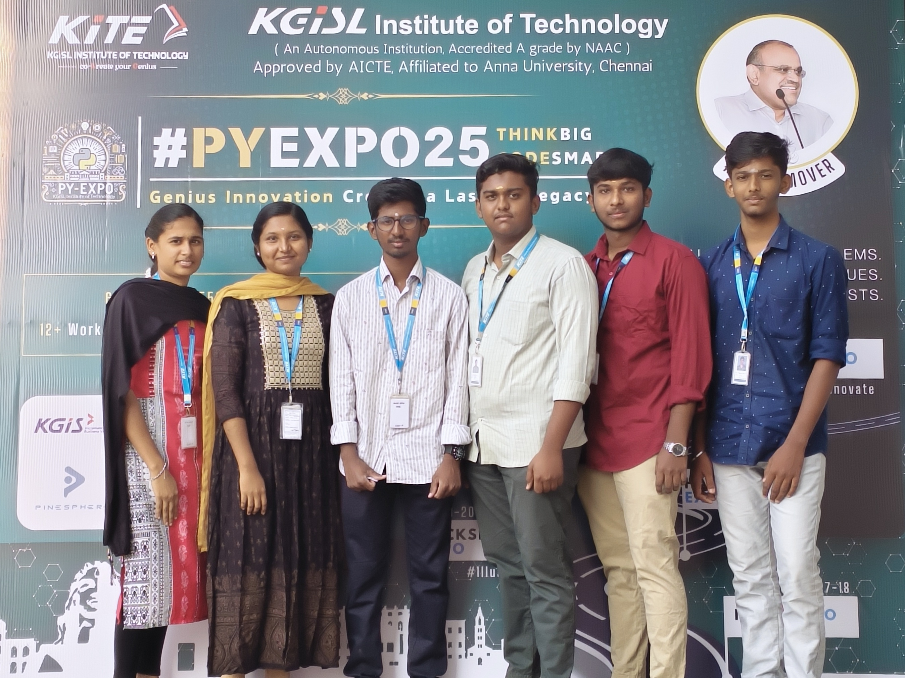

# T066_Guidos_Gang

---

## Problem Statement

*Problem Statement ID – PY058

IPL 2025 Winner Prediction
        The challenge entails creating a predictive model that leverages machine learning techniques in Python to forecast the outcome of the IPL 2025 tournament. To achieve this, historical datasets comprising match results, player performances, team statistics, venue details, and other relevant information will be utilized. The aim is to build a robust prediction system that can analyze past trends, player form, team strategies, and various influencing factors to provide accurate predictions about the potential winner of the IPL 2025 season

---

## Overview

Machine learning prediction using scikit learn (random forest and linear regression) additionally AI suggestions on the venues and combinations of the teams . Training the model with past records , Will predict even in the critical condition like key players early wickets and players dependency analysis by balancing and Recalculating the result .

---

## Team Members

*Team ID – T066

List your team members along with their roles.

- *RAAHUL KANAA.K* - Team Leader
- *VINOTHAA.S.P* - BACKEND
- *PRAVIN RAJA.M* - FRONTEND
- *SAMASTHUTHI.P* - FRONTEND
- *RAGUL.S* - FRONTEND
- *SRIRAM.S* - FRONTEND
- 

---

## Technical Stack

List the technologies and tools used in the project. For example:

- *Frontend:* HTML, CSS, JavaScript, ReactJS
- *Backend:* Django
- *Database:* MySQL
- *Other Tools:*  Git

---

## Getting Started

Follow these steps to clone and run the application locally.

### Prerequisites

1. Install [Python](https://www.python.org/downloads/).
2. Install [Git](https://git-scm.com/).
3. Clone this repository:
   bash
   git clone https://github.com/username/repository-name.git
   

### Installation

1. Navigate to the project directory:
   bash
   cd repository-name
   
2. Create a virtual environment:
   bash
   python -m venv venv
   
3. Activate the virtual environment:
   - On Windows:
     bash
     venv\Scripts\activate
     
   - On macOS/Linux:
     bash
     source venv/bin/activate
     
4. Install dependencies:
   bash
   pip install -r requirements.txt
   
5. Navigate to source
   bash
   cd source
   

---

## Start the Application

1. Run the Flask application:
   bash
   flask run
   
2. Open your browser and navigate to:
   
   http://127.0.0.1:5000/
   

---

## UI Overview

Images to demonstrate the user interface:

*Example pages:*

1. *Landing Page:*
   

2. *Dashboard:*
   

3. *Analytics View:*
   

---

## Resources

### 📄 PowerPoint Presentation
[Click here to view the PPT](insert-drive-link-here)

### 🎥 Project Video
[Click here to view the project demo video](insert-drive-link-here)

### 📹 YouTube Link
[Watch the project on YouTube](insert-youtube-link-here)

---
